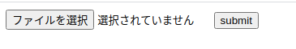

# clamd-http-server

`clamd-http-server` provides virus scan http api(?) with ClamAV.

## Systeme requirements

`clamd-http-server` is tested in the following environment.

+ Ubuntu 18.04
+ Docker Engine Community Edition 19.03.12
+ docker-compose 1.26.2
+ python 3.8.5

## Getting started

### How to launch

With `docker-compose up --build`, container images are build and start to run.

```console
cd src/
docker-compose up --build
```

With web browser, access `http://localhost:5000/`,
you'll get the following json response.

```json
{
  "Message": "This is index page."
}
```

If you got this response, `clamd-http-server` works.


### Virus check with a browser form

Access `http://localhost:5000/upload` and you'll see the form like following.
(My environment is Japanese environment, so when you use the another language environment
you'll see a little different image.)



Choose the file and click submit button, you'll get the JSON result.

```json
{
  "Message": "2020-05-06-224851.webm is uploaded.",
  "Result": "stream: OK"
}
```

There's no problem when you got `Result`, `"stream: OK"`.

### How to check with application code

Virus check api is made with the http form, so there might be something troublesome.
In the case, you'd like to use `clamd-http-server` from your application code,
please read `test_upload_eicar` in `src/clamd-http-server/test_clamd_http_server.py`.


## Architecture

```console
client -1-> [clamd-http-server] -2-> [clamd]                [freshclam]
                                       └ (Shared volume) <─3─┘
```

1. Client accesses `clamd-http-server` with HTTP request.
2. `clamd` receives TCP port accesses from `clamd-http-server`, and execute virus echeck.
3. `freshclam` updates Virus database in `clamd` container with the shared volume.
